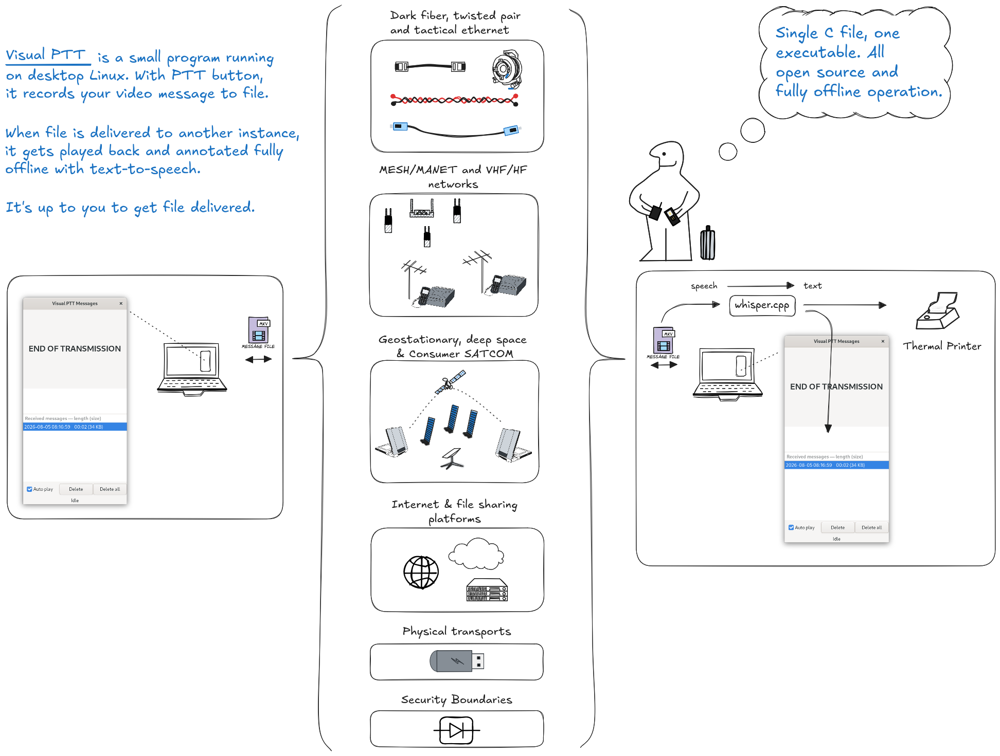

# Visual PTT

Small example programs to send and receive video messages via file system. 
Note that this project contains both written and generated code.

Status of this repository is Work In Progress!

## Reasoning



File-based communication provides a simple, flexible, and transport-independent
way to exchange asynchronous, non-linear messages. A completed message is a
self-contained object that can be queued, copied, delayed, replayed, annotated,
or transported by whatever mechanism is available. The applications at each
end do not need a continuous connection or knowledge of the underlying
transport.

This demonstration code is intended primarily as a real-life test bench for
human communication over geostationary-satellite and deep-space links. Their
latency and intermittent availability make ordinary real-time conversation
impractical, while persistent audiovisual messages allow each participant to
respond in their own time. The same approach is useful when developing
communication systems for other remote or austere environments with limited,
delayed, or unreliable connectivity.

The design can also be used when crossing security-level boundaries in
data-diode-connected environments. Messages can be transferred as discrete
files over an approved one-way path, then inspected, queued, and presented by
an isolated receiver. The surrounding deployment remains responsible for
appropriate validation, filtering, access control, and handling rules at each
security boundary.

## Installation

Install required packages:

```
sudo apt install \
libgtk-3-dev \
libgstreamer1.0-dev \
libgstreamer-plugins-base1.0-dev \
gstreamer1.0-alsa \
gstreamer1.0-plugins-base \
gstreamer1.0-plugins-good \
gstreamer1.0-plugins-bad \
gstreamer1.0-plugins-ugly \
ffmpeg
```

Build:

```
git clone https://github.com/resiliencetheatre/visualptt.git
cd visualptt
make
```

## Programs

`visualptt` is the complete application and the main development target of
this repository. It combines the persistent GTK message receiver with the
push-to-talk recorder, allowing one program to receive, review, and transmit
messages. New integrated user-facing functionality should normally be added
to `visualptt`.

The build also produces standalone programs. These remain useful for focused
testing, diagnostics, and deployments where only one part of the system is
needed:

| Program | Functionality |
| --- | --- |
| `visualptt` | Complete send-and-receive application. Displays a persistent list of incoming messages, supports playback, autoplay, deletion, and annotations, and records outgoing messages from the configured push-to-talk input. |
| `visualptt-rx-list` | Persistent receiver only. Lists incoming messages, retains them on disk, supports replay, autoplay, deletion, and annotations, but does not transmit. |
| `visualptt-rx` | Minimal receiver prototype. Watches for incoming messages and plays them in a single GTK window, deleting each message after playback. It does not provide the persistent message list or transmit. |
| `visualptt-tx` | Standalone push-to-talk transmitter. Monitors the input device configured in `pttkey.ini`, records a message, and moves the completed recording to the configured output directory. |
| `annotation-watcher` | Optional background companion. Extracts audio from completed messages with FFmpeg and invokes `whisper-cli` to create annotation files for the receiver UI. |

Run the main application with the incoming-message directory followed by the
destination for completed outgoing recordings:

```
visualptt --sender-id "EDGE" /path/to/incoming /path/to/outgoing
```

`--sender-id` (or `-s`) sets the sender label shown on transmitted video. It
must contain between one and eight characters so that it remains legible at
the 160x120 video resolution. If omitted, the label defaults to `EdgeCity`.

To run only the persistent GTK receiver:

```
visualptt-rx-list /path/to/incoming
```

Select a timestamp to replay that message. `Auto play` is enabled by default
and plays messages as they arrive; clearing it leaves new messages in the list
for manual playback.

If a matching annotation file exists beside a message (for example,
`rec_20260805_044147.txt` for `rec_20260805_044147.mkv`), its contents are shown
in the text area above `Auto play`. Annotations are optional and may arrive
after the video; the receiver checks for updates while it is running.
Deleting a message also removes matching `.txt` and `.wav` annotation files.

### Annotation watcher

`annotation-watcher` is built and installed with the other Visual PTT
programs. It watches a directory for completed `.mkv` messages, uses FFmpeg to
extract 16 kHz mono WAV audio, and passes that audio to `whisper-cli`. The
resulting `.wav` and `.txt` files are written beside the message and detected
automatically by the receiver.

Run it with the same incoming-message directory used by the receiver:

```
annotation-watcher -d /path/to/incoming
```

To print each new annotation with a compatible external printer utility, pass
its executable path with `-P`. Printing is optional and disabled by default:

```
annotation-watcher -d /path/to/incoming -P ./mbp32-print.py -S 18
```

The watcher invokes the utility as `PROGRAM --font-size SIZE MESSAGE`, where
`MESSAGE` is one argument in this form:

```
VisualPTT message: 2026-08-05 04:41:47
This is the annotated message collapsed to one line.
```

The timestamp is derived from a filename such as `rec_20260805_044147.mkv`.
If the printer cannot be started or returns an error, the watcher logs the
failure and keeps the successfully generated annotation. Use `-S` to select a
font size other than the default of `18`.

Available options are:

```
-d directory     directory to watch (default: samples)
-i seconds       polling interval from 1 to 3600 (default: 2)
-F path          FFmpeg executable (default: /usr/bin/ffmpeg)
-W path          whisper-cli executable (default: /usr/local/bin/whisper-cli)
-P path          printer utility (disabled by default)
-S size          printer font size (default: 18)
-h               show help
```

FFmpeg and [whisper.cpp](https://github.com/ggml-org/whisper.cpp) are runtime
requirements for annotation. Installing, building, and configuring
whisper.cpp is outside the scope of the Visual PTT installation.

Whisper.cpp also requires a compatible GGML model. The watcher calls
`whisper-cli` without `-m`, so the CLI's default model must be available as
`models/ggml-base.en.bin` relative to the directory from which the watcher is
started. Alternatively, `-W` can point to a compatible wrapper that supplies
the desired model and then invokes `whisper-cli`.

Follow the [upstream whisper.cpp quick start](https://github.com/ggml-org/whisper.cpp#quick-start)
for current build and model instructions. Its `make base.en` convenience
command downloads the `base.en` model automatically and runs inference after
building; the documented `models/download-ggml-model.sh` command can download
a model separately. Visual PTT and `annotation-watcher` do not download or
install whisper.cpp or its models.

The keyboard, PTT event values, hold threshold, and sounds still come from
`pttkey.ini`. The two command-line directories override its message paths.
After playback ends, the last annotation remains visible for 30 seconds by
default. Set `annotation_clear_delay_seconds` in the `[pttkey]` section to
change the delay; a value of `0` clears it immediately.

Audio capture defaults to `autoaudiosrc`, which follows the desktop audio
server's default microphone instead of assuming that ALSA card 0 is the wanted
device. This also allows GNOME/PipeWire to report the active recording stream.
It can be overridden in `pttkey.ini`; for example:

```
# Desktop default (recommended)
audio_source = autoaudiosrc

# A specific PulseAudio/PipeWire source (find names with: pactl list short sources)
audio_source = pulsesrc device=SOURCE_NAME

# A specific raw ALSA device (card 2, device 0)
audio_source = alsasrc device=hw:2,0
```

## Installation

Basic installation notes for Debian 13 host.

```
chown -R $USER:$USER /opt/visualptt
mkdir -p /opt/visualptt/output
cp pttkey.ini /opt/visualptt/
```

Create user service for visualptt-tx:

```
mkdir -p ~/.config/systemd/user
cp systemd/visualptt-tx.service ~/.config/systemd/user/
```

Make sure your user is part of required groups:

```
sudo usermod -aG audio,video,input $USER
```

Remember to reboot after changing these groups.

Enable and start systemd service:

```
systemctl --user daemon-reload
systemctl --user enable --now visualptt-tx.service
systemctl --user status visualptt-tx.service
```

## Configuration

`visualptt-tx` reads `pttkey.ini` from its working directory. To use the
keyboard's AltGr key as the push-to-talk button, first identify the keyboard's
Linux input device and verify the events generated by that key.

On Debian, Ubuntu, and related distributions, install `evtest` with:

```sh
sudo apt update
sudo apt install evtest
```

Run it without a device argument to display the available input devices:

```sh
sudo evtest
```

Select the keyboard from the numbered list. Alternatively, if its event device
is already known, pass it directly, for example:

```sh
sudo evtest /dev/input/event0
```

Press and release AltGr, then stop `evtest` with Ctrl+C. A successful test
should include the following events (timestamps will differ):

```text
Event: time 1786065252.194966, type 4 (EV_MSC), code 4 (MSC_SCAN), value b8
Event: time 1786065252.194966, type 1 (EV_KEY), code 100 (KEY_RIGHTALT), value 1
Event: time 1786065252.194966, -------------- SYN_REPORT ------------
Event: time 1786065252.426828, type 4 (EV_MSC), code 4 (MSC_SCAN), value b8
Event: time 1786065252.426828, type 1 (EV_KEY), code 100 (KEY_RIGHTALT), value 0
Event: time 1786065252.426828, -------------- SYN_REPORT ------------
```

The relevant lines are the `EV_KEY` events: input event type `1`, key code
`100` (`KEY_RIGHTALT`), value `1` when AltGr is pressed, and value `0` when it
is released. Configure those values in `pttkey.ini`:

```ini
[pttkey]
keyboard_device = /dev/input/event0
ptt_down_type = 1
ptt_down_code = 100
ptt_down_value = 1
ptt_up_type = 1
ptt_up_code = 100
ptt_up_value = 0
```

Replace `/dev/input/event0` with the keyboard device selected in `evtest`.
Event device numbers can change after reconnecting hardware or rebooting, so
repeat the test if AltGr stops being detected. The `MSC_SCAN` and `SYN_REPORT`
lines are normal and do not need to be added to `pttkey.ini`. Holding AltGr may
also produce `value 2` repeat events; the PTT press and release mappings should
remain `1` and `0`, respectively.

The user running `visualptt-tx` must have permission to read the selected
`/dev/input/event*` device. See the installation instructions above for input
group setup. Restart `visualptt-tx` after changing `pttkey.ini`.

## License

Visual PTT is free software licensed under the GNU General Public License,
version 3 or (at your option) any later version. See [LICENSE](LICENSE) for
the full license text.

The bundled `ini.c`, `ini.h`, `log.c`, and `log.h` helper files retain their
respective MIT license notices.
